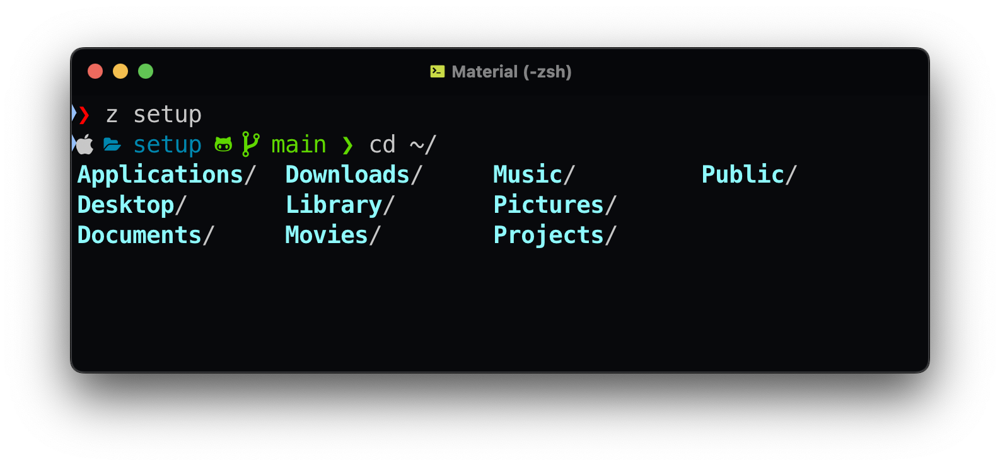

# 🚀 Floatrx's Zsh Setup

A stylish, efficient, and powerful terminal setup built around **Zsh** with the amazing **Powerlevel10k** theme, complete with handy aliases, smart autocompletion, quick navigation, and more.



## ⚙️ Theme configuration
To configure the theme, run the following command in your terminal:

```sh
p10k configure
```

## ✨ Features

- **Oh My Zsh** with Powerlevel10k theme
- **Autosuggestions** & **Syntax Highlighting**
- **fzf** for blazing-fast fuzzy file finding
- **z** for quick directory navigation
- Thoughtful set of **aliases** for productivity
- Convenient scripts for automated setup and backup

## 📦 What's Included?

### 🛠 Shell Environment

- [Oh My Zsh](https://ohmyz.sh/)
- [Powerlevel10k](https://github.com/romkatv/powerlevel10k) - Zsh theme
- [zsh-autosuggestions](https://github.com/zsh-users/zsh-autosuggestions) - suggests commands as you type
- [fzf](https://github.com/junegunn/fzf) - fuzzy finder
- [z](https://github.com/rupa/z) - cd on steroids

### 💻 CLI Tools & Apps (via Homebrew)

- **Git**, **Node.js**, **Bun**, **pnpm**
- **SQLite**, **btop**, **htop**, **neofetch**
- **WebStorm**, **VSCode**, **iTerm2** (via casks)

## ⚡ Installation

Run the automatic setup script:

```sh
chmod +x install.sh
./install.sh
```

This script will:

- Install [Homebrew](https://brew.sh) if not already installed
- Back up existing `.zshrc` and `.zsh_aliases`
- Create symbolic links for your new Zsh configs
- Install all necessary dependencies and applications

### 🧑‍💻 Copy configs
```sh
bash sync-configs.sh # will copy .zshrc and .zsh_aliases to your home directory creating backups
```

Copy `.env` template (once):
```shell
cp ./env.example ~/.env
```

Then apply changes:

```sh
source ~/.zshrc
```

## 📁 File Structure

```
.
├── .zshrc                   # Main Zsh configuration
├── .zsh_aliases             # Public aliases
├── .zsh_aliases_private     # Private aliases (not included in repo)
├── brew-apps-setup.sh       # Installs brew apps and casks
├── setup-zsh-env.sh         # Zsh environment setup
└── install.sh               # Automated installation script
```

## 📝 Aliases Overview

### General
- `c`: clear terminal
- `r`: reload zsh config
- `h`: quick history

### Git
- `gs`: git status
- `gcm`: git commit with message
- `gco`: checkout branch
- `gcb`: create & checkout new branch
- `gpl`: git pull
- `gps`: git push

### Directory Navigation (z)
- `zz`: list frequent directories
- `zr`: jump to ranked directory
- `zt`: jump to recently accessed directory

## 🔒 Keeping Things Private

Sensitive information and user-specific aliases (like IP addresses, SSH connections, or private directories) are stored in `~/.zsh_aliases_private`. This file is excluded from version control (`.gitignore`).

Load environment variables from `~/.env`


Made with ❤️ by [Floatrx](https://github.com/floatrx). Enjoy your productive terminal!

